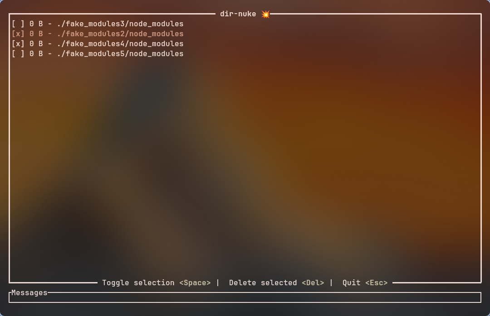

# dir-nuke

<p align="center">
  
</p>

<p align="center">
  
</p>

## Table of Contents
- [About](#about)
- [Important Information](#important-information)
- [Usage](#usage)

## About
This project is a directory nuker. It is designed to safely and efficiently remove specified directories and their contents.

## Important Information
- **Purpose**: To provide a reliable tool for directory deletion.
- **Safety**: Always double-check the directories you are targeting for deletion, as this operation is irreversible.
- **Development**: This project is written in Rust.


## Usage

<details><summary>🚀 Quick Install</summary>

To install the latest version of dir-nuke, run:

```sh
curl -sSfL https://raw.githubusercontent.com/brunohaetinger/dir-nuke/main/scripts/install-dir-nuke.sh | bash
```

This script will:

  1. Detect your OS and CPU architecture
  1. Download the latest release from GitHub
  1. Install dir-nuke into /usr/local/bin (you may need sudo access)

After installation:

```sh
dir-nuke --help
```

</details>

<details><summary>Building yourself</summary>

> Rust is required on this method

1. Clone the project
2. Run the following to search into `~/Projects` directory:
```sh
cargo run --bin dir-nuke ~/Projects
``` 
</details>


###

### TUI Keybindings

| Keybinding        | Action                               |
|-------------------|--------------------------------------|
| `Down`, `j`, `Tab`| Move down on the list                |
| `Up`, `k`, `BackTab`| Move up on the list                  |
| `Space`           | Toggle selection of a directory      |
| `h`               | Unselect current item                |
| `l`               | Select current item                  |
| `Enter`           | Confirm and delete selected directories |
| `Esc`, `q`        | Cancel application and exit          |
