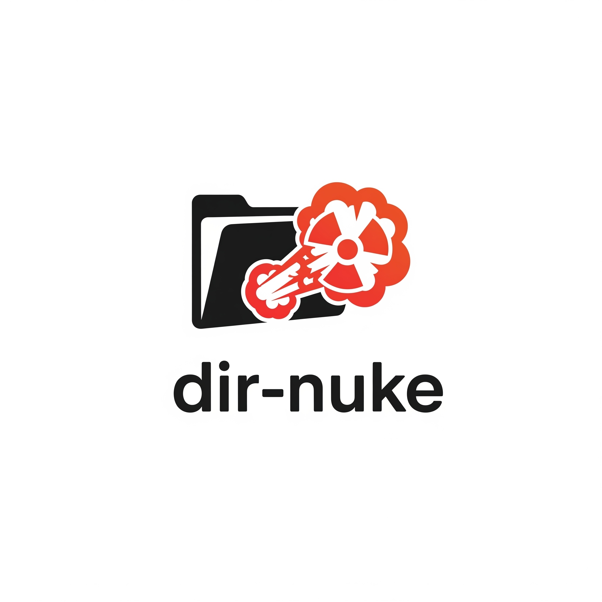

# dir-nuke

  

## Table of Contents
- [About](#about)
- [Important Information](#important-information)

## About
This project is a directory nuker. It is designed to safely and efficiently remove specified directories and their contents.

## Important Information
- **Purpose**: To provide a reliable tool for directory deletion.
- **Usage**: Refer to the `src/main.rs` file for command-line arguments and usage instructions.
- **Safety**: Always double-check the directories you are targeting for deletion, as this operation is irreversible.
- **Development**: This project is written in Rust.
